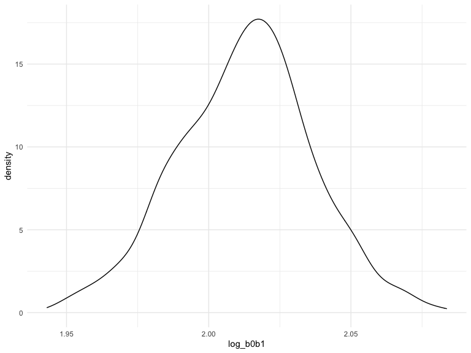

Homework 6
================
Zhenyu Zhou

``` r
library(tidyverse)
library(modelr)
library(skimr)
```

### Problem 1

To obtain a distribution for $\hat{r}^2$, we’ll follow basically the
same procedure we used for regression coefficients: draw bootstrap
samples; the a model to each; extract the value I’m concerned with; and
summarize. Here, we’ll use `modelr::bootstrap` to draw the samples and
`broom::glance` to produce `r.squared` values.

``` r
weather_df = 
  rnoaa::meteo_pull_monitors(
    c("USW00094728"),
    var = c("PRCP", "TMIN", "TMAX"), 
    date_min = "2017-01-01",
    date_max = "2017-12-31") %>%
  mutate(
    name = recode(id, USW00094728 = "CentralPark_NY"),
    tmin = tmin / 10,
    tmax = tmax / 10) %>%
  select(name, id, everything())
```

    ## Registered S3 method overwritten by 'hoardr':
    ##   method           from
    ##   print.cache_info httr

    ## using cached file: ~/Library/Caches/R/noaa_ghcnd/USW00094728.dly

    ## date created (size, mb): 2022-09-21 18:00:48 (8.402)

    ## file min/max dates: 1869-01-01 / 2022-09-30

``` r
weather_df %>% 
  modelr::bootstrap(n = 1000) %>% 
  mutate(
    models = map(strap, ~lm(tmax ~ tmin, data = .x) ),
    results = map(models, broom::glance)) %>% 
  select(-strap, -models) %>% 
  unnest(results) %>% 
  ggplot(aes(x = r.squared)) + geom_density()
```


In this example, the $\hat{r}^2$ value is high, and the upper bound at 1
may be a cause for the generally skewed shape of the distribution. If we
wanted to construct a confidence interval for $R^2$, we could take the
2.5% and 97.5% quantiles of the estimates across bootstrap samples.
However, because the shape isn’t symmetric, using the mean +/- 1.96
times the standard error probably wouldn’t work well.

We can produce a distribution for $\log(\beta_0 * \beta1)$ using a
similar approach, with a bit more wrangling before we make our plot.

``` r
weather_df %>% 
  modelr::bootstrap(n = 1000) %>% 
  mutate(
    models = map(strap, ~lm(tmax ~ tmin, data = .x) ),
    results = map(models, broom::tidy)) %>% 
  select(-strap, -models) %>% 
  unnest(results) %>% 
  select(id = `.id`, term, estimate) %>% 
  pivot_wider(
    names_from = term, 
    values_from = estimate) %>% 
  rename(beta0 = `(Intercept)`, beta1 = tmin) %>% 
  mutate(log_b0b1 = log(beta0 * beta1)) %>% 
  ggplot(aes(x = log_b0b1)) + geom_density()
```



As with $r^2$, this distribution is somewhat skewed and has some
outliers.

The point of this is not to say you should always use the bootstrap –
it’s possible to establish “large sample” distributions for strange
parameters / values / summaries in a lot of cases, and those are great
to have. But it is helpful to know that there’s a way to do inference
even in tough cases.

### Problem 2

Import dataset

``` r
homicide_df = 
  read_csv("Data/homicide-data.csv") %>%
  mutate(
    city_state = str_c(city, ", ", state),
    solved = ifelse(disposition %in% c("Closed without arrest", "Open/No arrest"), FALSE, TRUE)
  ) %>%
  filter(!(city_state %in% c("Dallas, TX", "Phoenix, AZ", "Kansas City, MO", "Tulsa, AL"))) %>%
  filter(!(city_state %in% c("Tulsa, AL"))) %>%
  filter(victim_race %in% c("White", "Black")) %>%
  mutate(
    victim_age = as.numeric(victim_age),
    victim_sex = as.factor(ifelse(victim_sex == "Unknown", NA, victim_sex)),
    victim_race = as.factor(victim_race)
  )
```

    ## Rows: 52179 Columns: 12
    ## ── Column specification ────────────────────────────────────────────────────────
    ## Delimiter: ","
    ## chr (9): uid, victim_last, victim_first, victim_race, victim_age, victim_sex...
    ## dbl (3): reported_date, lat, lon
    ## 
    ## ℹ Use `spec()` to retrieve the full column specification for this data.
    ## ℹ Specify the column types or set `show_col_types = FALSE` to quiet this message.

``` r
fit_logistic = 
  homicide_df %>%
  filter(city == "Baltimore") %>%
  glm(solved ~ victim_age + victim_sex + victim_race, data = ., family = binomial())

fit_logistic %>%
  broom::tidy() %>% 
  mutate(OR = exp(estimate),
         ci_lower = exp(estimate - 1.96*std.error),
         ci_upper = exp(estimate + 1.96*std.error)) %>%
  filter(term == "victim_sexMale") %>% 
  select(term, log_OR = estimate, OR, ci_lower, ci_upper) %>%
  knitr::kable(digits = 3)
```

| term           | log_OR |    OR | ci_lower | ci_upper |
|:---------------|-------:|------:|---------:|---------:|
| victim_sexMale | -0.854 | 0.426 |    0.325 |    0.558 |

``` r
glm_training = function(city_data){
  glm_model = glm(solved ~ victim_age + victim_sex + victim_race, data = city_data, family = binomial())
  glm_model %>%
    broom::tidy() %>%
    mutate(
      OR = exp(estimate),
      CI_lower = exp(estimate + qnorm(0.025) * std.error),
      CI_upper = exp(estimate + qnorm(0.975) * std.error)
    ) %>%
    filter(term == "victim_sexMale") %>%
    select(OR, CI_lower, CI_upper)
}
```

``` r
cities_OR = 
  homicide_df %>%
  select(city_state:solved, victim_race:victim_sex) %>%
  nest(input_data = solved:victim_sex) %>%
  mutate(
    fit_logistic_city = purrr::map(input_data, glm_training)
  ) %>%
  select(city_state, fit_logistic_city) %>%
  unnest(fit_logistic_city)
```

``` r
cities_OR %>%
  mutate(
    city_state = fct_reorder(city_state, OR)
  ) %>%
  ggplot(aes(x = city_state,y = OR)) +
  geom_point() +
  geom_errorbar(aes(ymax = CI_upper,ymin = CI_lower)) +
  labs(x = "City, State", y = "Adjusted Odds Ratio") + 
  theme(title = element_text(size = 8),
        axis.text.x = element_text(angle = 70, hjust = 1)
  )
```


In many cities, homicides with male victims are harder to solve than
homicides with female victims. For example, most cities have estimated
odds ratios below 1, indicating that homicides with male victims are
more solved than homicides with female victims chances are lower.

### Problem 3

Load and clean the data for regression analysis

``` r
bw_df = read_csv("./data/birthweight.csv") %>% 
  mutate(babysex = as.factor(babysex),
         frace = as.factor(frace),
         mrace = as.factor(mrace),
         malform = as.factor(malform))
```

``` r
bw_df %>% 
  skim()
```

|                                                  |            |
|:-------------------------------------------------|:-----------|
| Name                                             | Piped data |
| Number of rows                                   | 4342       |
| Number of columns                                | 20         |
| \_\_\_\_\_\_\_\_\_\_\_\_\_\_\_\_\_\_\_\_\_\_\_   |            |
| Column type frequency:                           |            |
| factor                                           | 4          |
| numeric                                          | 16         |
| \_\_\_\_\_\_\_\_\_\_\_\_\_\_\_\_\_\_\_\_\_\_\_\_ |            |
| Group variables                                  | None       |

Data summary

**Variable type: factor**

| skim_variable | n_missing | complete_rate | ordered | n_unique | top_counts                      |
|:--------------|----------:|--------------:|:--------|---------:|:--------------------------------|
| babysex       |         0 |             1 | FALSE   |        2 | 1: 2230, 2: 2112                |
| frace         |         0 |             1 | FALSE   |        5 | 1: 2123, 2: 1911, 4: 248, 3: 46 |
| malform       |         0 |             1 | FALSE   |        2 | 0: 4327, 1: 15                  |
| mrace         |         0 |             1 | FALSE   |        4 | 1: 2147, 2: 1909, 4: 243, 3: 43 |

**Variable type: numeric**

| skim_variable | n_missing | complete_rate |    mean |     sd |     p0 |     p25 |     p50 |     p75 |   p100 | hist  |
|:--------------|----------:|--------------:|--------:|-------:|-------:|--------:|--------:|--------:|-------:|:------|
| bhead         |         0 |             1 |   33.65 |   1.62 |  21.00 |   33.00 |   34.00 |   35.00 |   41.0 | ▁▁▆▇▁ |
| blength       |         0 |             1 |   49.75 |   2.72 |  20.00 |   48.00 |   50.00 |   51.00 |   63.0 | ▁▁▁▇▁ |
| bwt           |         0 |             1 | 3114.40 | 512.15 | 595.00 | 2807.00 | 3132.50 | 3459.00 | 4791.0 | ▁▁▇▇▁ |
| delwt         |         0 |             1 |  145.57 |  22.21 |  86.00 |  131.00 |  143.00 |  157.00 |  334.0 | ▅▇▁▁▁ |
| fincome       |         0 |             1 |   44.11 |  25.98 |   0.00 |   25.00 |   35.00 |   65.00 |   96.0 | ▃▇▅▂▃ |
| gaweeks       |         0 |             1 |   39.43 |   3.15 |  17.70 |   38.30 |   39.90 |   41.10 |   51.3 | ▁▁▂▇▁ |
| menarche      |         0 |             1 |   12.51 |   1.48 |   0.00 |   12.00 |   12.00 |   13.00 |   19.0 | ▁▁▂▇▁ |
| mheight       |         0 |             1 |   63.49 |   2.66 |  48.00 |   62.00 |   63.00 |   65.00 |   77.0 | ▁▁▇▂▁ |
| momage        |         0 |             1 |   20.30 |   3.88 |  12.00 |   18.00 |   20.00 |   22.00 |   44.0 | ▅▇▂▁▁ |
| parity        |         0 |             1 |    0.00 |   0.10 |   0.00 |    0.00 |    0.00 |    0.00 |    6.0 | ▇▁▁▁▁ |
| pnumlbw       |         0 |             1 |    0.00 |   0.00 |   0.00 |    0.00 |    0.00 |    0.00 |    0.0 | ▁▁▇▁▁ |
| pnumsga       |         0 |             1 |    0.00 |   0.00 |   0.00 |    0.00 |    0.00 |    0.00 |    0.0 | ▁▁▇▁▁ |
| ppbmi         |         0 |             1 |   21.57 |   3.18 |  13.07 |   19.53 |   21.03 |   22.91 |   46.1 | ▃▇▁▁▁ |
| ppwt          |         0 |             1 |  123.49 |  20.16 |  70.00 |  110.00 |  120.00 |  134.00 |  287.0 | ▅▇▁▁▁ |
| smoken        |         0 |             1 |    4.15 |   7.41 |   0.00 |    0.00 |    0.00 |    5.00 |   60.0 | ▇▁▁▁▁ |
| wtgain        |         0 |             1 |   22.08 |  10.94 | -46.00 |   15.00 |   22.00 |   28.00 |   89.0 | ▁▁▇▁▁ |

``` r
bw_df = bw_df %>% 
  select(-pnumlbw, -pnumsga)
```

There is no missing value in the current dataset. Since data entries for
two variables **pnumlbw** and **pnumsga** are zero, we choose to drop
these variables.

``` r
bw_dfm = bw_df %>% 
  select(-parity, -malform, -smoken, -frace, -ppwt, -delwt)
```

Besides variables mentioned above, variables **parity**, **malform**,
and **smoken** are highly skewed, thus I choose to remove the three
variables. Variables \_ppwt\_\_ and **delwt** are also removed
considering mother’s weight at delivery minus mother’s weight before
pregnancy equals the Variable \_wtgain\_\_. Based on the hypothesis that
father’s race is not significantly associated with brith weight, the
predictor variables used in my model are babysex, bhead, blength, bwt,
fincome, gaweeks, menarche, mheight, momage, mrace, ppbmi, wtgain.

``` r
bw_model = lm(bwt ~ ., data = bw_dfm)
summary(bw_model)
```

    ## 
    ## Call:
    ## lm(formula = bwt ~ ., data = bw_dfm)
    ## 
    ## Residuals:
    ##      Min       1Q   Median       3Q      Max 
    ## -1080.29  -184.00    -4.33   176.89  2411.56 
    ## 
    ## Coefficients:
    ##               Estimate Std. Error t value Pr(>|t|)    
    ## (Intercept) -6492.6758   140.8468 -46.097  < 2e-16 ***
    ## babysex2       32.6297     8.5152   3.832 0.000129 ***
    ## bhead         132.8272     3.4681  38.300  < 2e-16 ***
    ## blength        76.2685     2.0289  37.592  < 2e-16 ***
    ## fincome         0.3119     0.1803   1.730 0.083772 .  
    ## gaweeks        10.7548     1.4701   7.316 3.04e-13 ***
    ## menarche       -4.0316     2.9143  -1.383 0.166613    
    ## mheight        11.4649     1.6626   6.896 6.14e-12 ***
    ## momage          1.0412     1.2269   0.849 0.396119    
    ## mrace2       -115.7410     9.9578 -11.623  < 2e-16 ***
    ## mrace3        -50.7342    42.9824  -1.180 0.237927    
    ## mrace4        -84.7970    19.4380  -4.362 1.32e-05 ***
    ## ppbmi           7.3893     1.3686   5.399 7.05e-08 ***
    ## wtgain          3.9580     0.3967   9.976  < 2e-16 ***
    ## ---
    ## Signif. codes:  0 '***' 0.001 '**' 0.01 '*' 0.05 '.' 0.1 ' ' 1
    ## 
    ## Residual standard error: 274.6 on 4328 degrees of freedom
    ## Multiple R-squared:  0.7134, Adjusted R-squared:  0.7126 
    ## F-statistic: 828.8 on 13 and 4328 DF,  p-value: < 2.2e-16

``` r
bw_newmodel = lm(bwt ~ babysex + bhead + blength + fincome + gaweeks + mheight + mrace + ppbmi + wtgain, data = bw_dfm)
```

Since the coefficients of variables **menarche** and **momage** are not
significant at 0.1 significance level, the R-sqaured is not impaired
after dropping the two variables(0.7134221 vs. 0.7132718)

``` r
bw_newmodel %>% 
  broom::tidy() %>% 
  select(term, estimate, p.value) %>% 
  knitr::kable()
```

| term        |      estimate |   p.value |
|:------------|--------------:|----------:|
| (Intercept) | -6529.0616379 | 0.0000000 |
| babysex2    |    32.5208997 | 0.0001350 |
| bhead       |   132.7810026 | 0.0000000 |
| blength     |    76.3072692 | 0.0000000 |
| fincome     |     0.3484445 | 0.0479049 |
| gaweeks     |    10.7986853 | 0.0000000 |
| mheight     |    11.4134011 | 0.0000000 |
| mrace2      |  -117.8229618 | 0.0000000 |
| mrace3      |   -50.0025883 | 0.2403486 |
| mrace4      |   -86.2910900 | 0.0000089 |
| ppbmi       |     7.7438872 | 0.0000000 |
| wtgain      |     3.9588936 | 0.0000000 |

``` r
bw_dfm %>% 
  add_residuals(bw_newmodel) %>% 
  add_predictions(bw_newmodel) %>% 
  ggplot(aes(x = pred, y = resid)) +
  geom_point() +
  stat_smooth(method = "lm")
```

    ## `geom_smooth()` using formula 'y ~ x'


``` r
cv_df = 
  crossv_mc(bw_dfm, 100) %>% 
  mutate(train = map(train, as_tibble),
         test = map(test, as_tibble)) %>% 
  mutate(model_1  = map(train, ~lm(bwt ~ babysex + bhead + blength + fincome + 
                                     gaweeks + mheight + mrace + ppbmi + wtgain, data = .x)),
         model_2  = map(train, ~lm(bwt ~ blength + gaweeks, data = .x)),
         model_3  = map(train, ~lm(bwt ~ blength*bhead*babysex, data = .x))) %>% 
  mutate(rmse_1 = map2_dbl(model_1, test, ~rmse(model = .x, data = .y)),
         rmse_2 = map2_dbl(model_2, test, ~rmse(model = .x, data = .y)),
         rmse_3 = map2_dbl(model_3, test, ~rmse(model = .x, data = .y)))
```

``` r
cv_df %>% 
  select(starts_with("rmse")) %>% 
  pivot_longer(
    everything(),
    names_to = "model",
    values_to = "rmse",
    names_prefix = "rmse_"
  ) %>% 
  ggplot(aes(x = model, y = rmse, color = model)) +
  geom_violin() +
  labs(x = "Model", y = "RMSE") 
```


Based on the violin plot, model 1 has the lowest level of prediction
error probably due to the the large number of predictor variables. The
best model is model 1.
